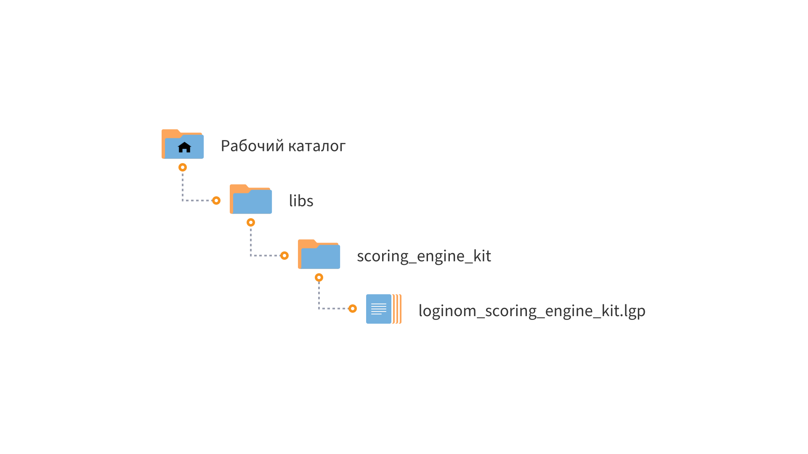

# Loginom Scoring Engine Kit

* Версия 3.0.0
* Проверено: Все редакции Loginom 7.0.2

В компонентах библиотеки **Loginom Scoring Engine Kit** реализован алгоритм расчёта скорингового балла по готовой скоринговой карте. Возможен расчёт для карт двух форматов:

* с преобразованием всех атрибутов в категориальные;
* с преобразованием только непрерывных атрибутов в категориальные.

Кроме того реализовано формирование списка причин отказа.

## Установка

1. Определите рабочий каталог, где будут расположены ваши библиотеки:

   * Для серверных редакций — в рабочем каталоге Loginom Server (в папке пользователя или в общей папке пользователей);
   * Для настольных редакций — в любой папке на локальном диске.

2. Создайте в нем подкаталог **libs**.

3. Разместите папку **scoring_engine_kit** в каталоге **libs**.

4. Добавьте ссылку на пакет **loginom_scoring_engine_kit.lgp** в своем пакете и используйте компоненты библиотеки.

## Требования

Для работы библиотеки **Loginom Scoring Engine Kit** необходимо:

* Установленное ПО Loginom. Версия не ниже 7.0.2

## Список компонентов

* Преобразование атрибутов 1
* Преобразование атрибутов 2
* Скоринговая карта
* Причины отказа

Подробное описание компонентов доступно в [документации](docs/loginom-scoring-engine-kit.pdf).